# Brainster Final Project: 

## Group 2 - Team 1
Team Members:
* Jasmina Lavchanska - Nikolovska ( Team Leader )
* Dimitri Kjososki
* Ivica Todorovski
* Tina Stefanovska
* Polad Emin

# Project Title: Beautif.ai

 * Description
 * How does it work?
 * The project implementation
   * Phase 1: Dataset creation
   * Phase 2: Training the model
   * Phase 3: Validation
 * Summary of results

## Description

Beautif.ai is an ios mobile application designed to edit and enhance pictures on a mobile device meant for personal and business usage. The goal of the project is to create a robust classifier that will be able to detect whether an image consists of Daylight Sky, Night Sky, or No sky at all. Furthermore, during the dataset collection phase, the team decided that one more class should be added in order to identify whether the sky in the night photos is well separated or not. The final set of classes is:
 * Daylight Sky
 * Night sky which can be separated
 * Night Sky without well-defined separation points
 * Images without sky (indoor or outdoor). 

The model will be integrated into the application for further use.

## How does it work? 

This model will find use in recognizing and separating the sky from the rest of the objects on the photo. Once a picture is taken, the application by itself will recognize if there is a sky at all, and then recognize if it is a day or night in order to identify if sky-algorithm should be offered as an option to the user to edit the sky.

## The process

The project implementation was divided into 3 phases:

Phase 1: Dataset Generation
  * Dataset Collection
  * Dataset Preparation

Phase 2: Training the model
  * Compose neural network architectures
  * Ping Pong phase with Dataset labelers
  * Fine-tuning of the model

Phase 3: Validation
  * Analysis and benchmark Precision/Recall
  * Predictions of random images

### Phase 1: Dataset Generation

In order to train a deep-learning model regarding requests, we needed an appropriate dataset with a balanced distribution of images for the four above-stated classes. 
One of the challenges we met during this project was collecting the data. We decided to combine images from the existing dataset previously used in a similar MIT project and private photos from the team members. This approach was selected in order to have high diversity in the dataset since the time and resources of the team members were limited. 
Data preparation consisted of labeling, renaming, and resizing the collected dataset.
The final dataset (available [here](https://drive.google.com/drive/folders/14aPhB-LHJTDZethUfNkBkM80b1Cm5fAE?usp=sharing)) cosists of **8640** images with train - validation split of 85% - 15%:

Class Name | Number of images | Example 1 | Example 2 | Example 3 | Example 4 | Example 5
------------ | ------------- | ------------- | ------------- | ------------- | ------------- | -------------
Daylight Sky | 3304 |  |  |  |  | 
Night sky separated | 658 |  | 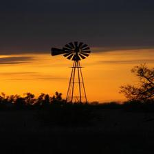| 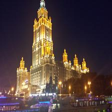 | 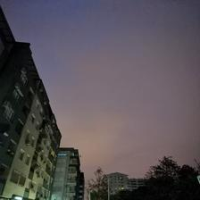 | 
Night sky not separated | 887 | 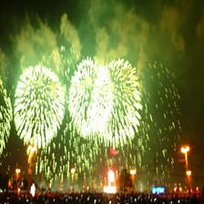 | 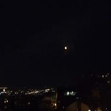 |  |  | 
No sky | 3791 | 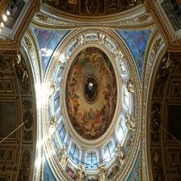 |  |  |  | 

Set distribution by class is shown below:

.png)

### Phase 2: Training and Deployment

To solve this problem, we have tried several image classifiers that classify one of four categories. To construct this classifier, we used pre-trained CNN:
 * ResNet50
 * ResNet101
 * ResNet152
 * Xception
 * VGG16
 * VGG19
 * InceptionV3
 * InceptionResNetV2
 * DenseNet201
 * DenseNet169

Even though most of the validation accuracy was over 80%, the best performing models were ResNet models, particularly ResNet101. The best result based on validation accuracy is  **90.825%** which was achieved with transfer-learning using pre-trained ResNet101, with no re-trained layers, using 50 epoch, Batch size of 15, and added dropout and batch normalization layers in order to prevent overfitting.

### Phase 3: Validation

Validation of the model results was done on the Validation set and on about 30 new images. Performance of the model, based on validation is represented throughout the Evaluation matrix and Confusion matrix below:

**Evaluation matrix**

Class Name | Precision | Recall | f1-score
------------ | ------------- | ------------- | ------------- 
Daylight Sky | 0.91 | 0.93 | 0.92
Night sky separated | 0.76 | 0.66 | 0.70
Night sky not separated | 0.79 | 0.80 | 0.80
No sky | 0.93 | 0.93 | 0.93

**Confusion matrix**

Out of misclassified images from the Validation set, here are 3 by each defined class:

Class Name | Number of missed classified | Predicted Sky | Predicted Night sky | Predicted Night No_sky | Predicted No_sky  
------------ | ------------- | ------------- | ------------- | ------------- | ------------- 
Daylight Sky | 35 | | 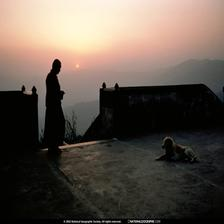|  |  
Night sky separated | 34 | 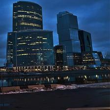 | |  | 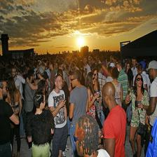 
Night sky not separated | 26 |  |  | |  
No sky | 40 |  | 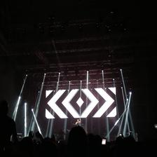 | 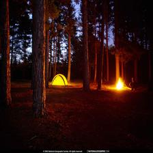  | 

Regarding the model performance, it would be fair to add that some of the images were complicated to label even for us. Some examples of those images you can find in the table below:

Classified: Sky | Classified: Night sky | Classified: Night No_sky | Classified: No_sky  
------------- | ------------- | ------------- | ------------- 
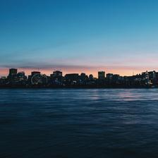|  |  | 

The prediction was done on images not included in the validation set, as well. The performance results on those images were extraordinary and exceeded our expectations:

Class Name | Number of predisted items | Predicted Sky | Predicted Night sky | Predicted Night No_sky | Predicted No_sky  
------------ | ------------- | ------------- | ------------- | ------------- | ------------- 
Daylight Sky | 15 | 15 | 0 | 0 | 0
Night sky separated | 7 | 0 | 7 | 0 | 0 
Night sky not separated | 6 | 0 | 0 | 6 | 0 
No sky | 20 | 1 | 0 | 0 | 19

## Summary of results

To improve: more precise definition of the classes, increase images in the Train and Validation set, especially in the classes which have fewer elements; synthetic images.
