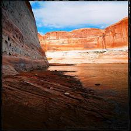
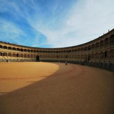
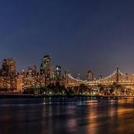
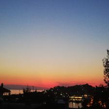
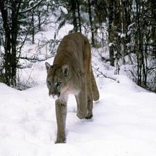

# Brainster Final Project: 

## Group 2 - Team 1
Team Members:
* Jasmina Lavchanska - Nikolovska ( Team Leader )
* Dimitri Kjososki
* Ivica Todorovski
* Tina Stefanovska
* Polad Emin

# Project Title: Beautif.ai

 * Description
 * How does it work?
 * The project implementation
   * Phase 1 : Dataset creation
   * Phase 2 : Training the model
   * Phase 3 : Validation
 * Summary of results

## Description

Beautif.ai is an ios mobile application designed to edit and enhance pictures on a mobile device meant for personal and business usage. The goal of the project is to create a robust classifier which will be able to detect whether an image consists of Daylight Sky, Night sky or No sky at all. Furthermore, during the dataset collection phase, the team decided that one more class should be added in order to identify whether the sky in the night photos is well separated or not. The final set of classes is:
 * Daylight Sky
 * Night sky which can be separated
 * Night Sky without well defined separation points
 * Images without sky (indoor or outdoor). 

The model will be integrated in the application for further use.

## How does it work?

This model will find a use in recognizing and separating the sky from the rest of the objects on the photo. Once a picture is taken, the application by itself will recognize if there is a sky at all, and then to recognize if it is a day or night in order to identify if sky-algorithm shoud be offered as an option to the user to edit the sky.

## The process

The project implementation was divided in 3 phases:

Phase 1 : Dataset Generation
  * Dataset Collection
  * Dataset Preparation

Phase 2 : Training and Deployment
  * Compose neural network architectures
  * Ping Pong phase with Dataset labelers
  * Fine tunning of the model

Phase 3 : Validation
  * Analysis and benchmark Precision/Recall
  * Predictions of random images

### Phase 1: Dataset Generation

In order to train a deep-learning model regarding requests, we needed an appropriate dataset with balanced distribution of images for the four above stated classes. 
One of the challenges we met during this project was collecting the data. We decided to combine images from existing dataset previously used in similar MIT project and private photos from the team members. This approach was selected in oreder to have high diversity in the dataset since the time and resources of the team members were limited. 
Data preparation consisted of labeling, renaming and resizing the collected dataset.
The final dataset cosists of **8640** images with train - validation split of 85% - 15%:

Class Name | Number of images | Example 1 | Example 2 | Example 3 | Example 4 | Example 5
------------ | ------------- | ------------- | ------------- | ------------- | ------------- | -------------
Daylight Sky | 3304 |  |  |  |  | 
Night sky separated | 658 |  | |  |  | 
Night sky not separated | 887 |  |  |  |  | 
No sky | 3791 |  |  |  |  | 

Distribution by class:

![GitHub graph]</Images/Graphs/image%20(5).png" width="400" height="790">

### Phase 2: Training and Deployment

To solve this problem, we needed to try several image classifiers that classify one of four categories:
 * ResNet50
 * ResNet101
 * ResNet152
 * Xception
 * VGG16
 * VGG19
 * InceptionV3
 * InceptionResNetV2
 * DenseNet201
 * DenseNet169

To construct this classifier, we used pre-trained CNN. 

Eventhough most of the validation accuracy were over 80%, the best performing model wer ResNet models, particulary ResNet101. The top 3 results are as follows:
Model | Test Accuracy
------------ | -------------
ResNet101 | 0.90902
ResNet101 | 0.90825

